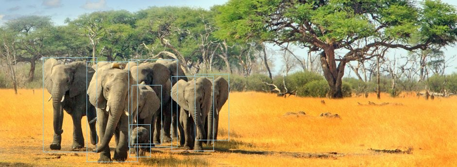

# YOLOv4

> A TensorFlow 2.0 implementation of YOLOv4: Optimal Speed and Accuracy of Object Detection

[](https://pypi.org/project/tf2-yolov4/)


[](https://github.com/python/black)
[](https://github.com/sicara/tf2-yolov4/actions?query=workflow%3A%22Python+package%22)
[](https://colab.research.google.com/github/sicara/tf2-yolov4/blob/master/notebooks/YoloV4_Dectection_Example.ipynb)

This implementation runs (for now) inference with the original Darknet weights from [AlexeyAB](https://www.github.com/AlexeyAB/darknet).
See the roadmap section to see what's next.

<p align="center">
    
</p>

## Installation

To install this package, you can run:

```bash
pip install tf2_yolov4
pip install tensorflow
# Check that tf2_yolov4 is installed properly
python -c "from tf2_yolov4.model import YOLOv4; print(YOLOv4)"
```

Requirements:

- MacOs >= 10.15 since tensorflow-addons is not available for older release of MacOs
- Python >= 3.6
- Compatible versions between TensorFlow and TensorFlow Addons: check the [compatibility matrix](https://github.com/tensorflow/addons#python-op-compatibility-matrix)

## Examples in Colab

- [Run detection on a single image](./notebooks/YoloV4_Dectection_Example.ipynb) / [](https://colab.research.google.com/github/sicara/tf2-yolov4/blob/master/notebooks/YoloV4_Dectection_Example.ipynb)

## Pretrained weights

Our YOLOv4 implementation supports the `weights` argument similarly to Keras applications. To load a model with pretrained
weights, you can simply call:

```python
# Loads Darknet weights trained on COCO
model = YOLOv4(
    input_shape,
    num_classes,
    anchors,
    weights="darknet",
)
```

If weights are available locally, they will be used. Otherwise, they will be automatically downloaded.

## Roadmap

- [x] Inference
    - [x] CSPDarknet53 backbone with Mish activations
    - [x] SPP Neck
    - [x] YOLOv3 Head
    - [x] Load Darknet Weights
    - [x] Image loading and preprocessing
    - [x] YOLOv3 box postprocessing
    - [x] Handling non-square images
- [ ] Training
    - [ ] Training loop with YOLOv3 loss
    - [ ] CIoU loss
    - [ ] Cross mini-Batch Normalization
    - [ ] Self-adversarial Training
    - [ ] Mosaic Data Augmentation
    - [ ] DropBlock
- [ ] Enhancements
    - [x] Automatic download of pretrained weights (like Keras applications)

## References

- [yolov3-tf2](https://github.com/zzh8829/yolov3-tf2)
